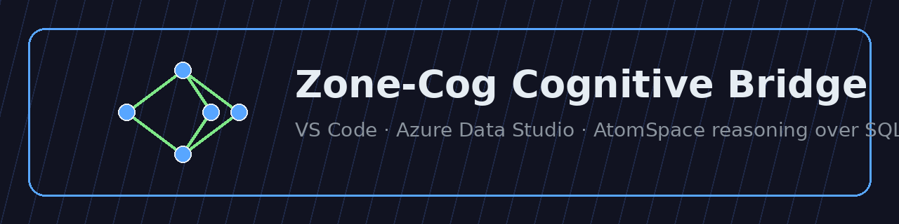
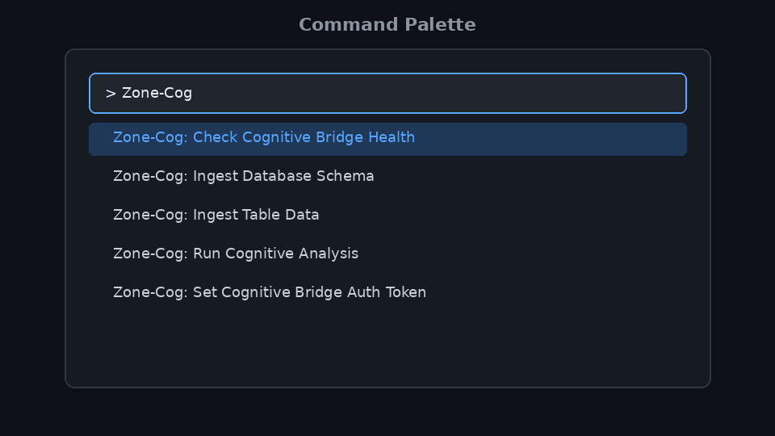
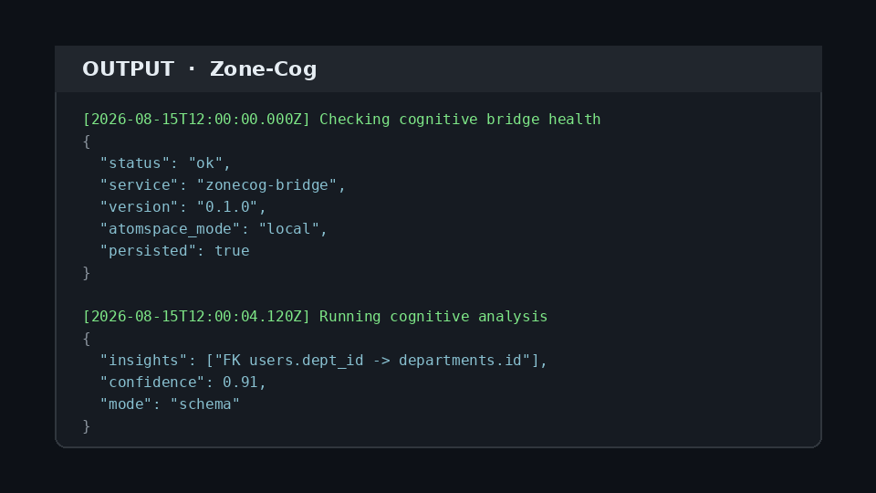
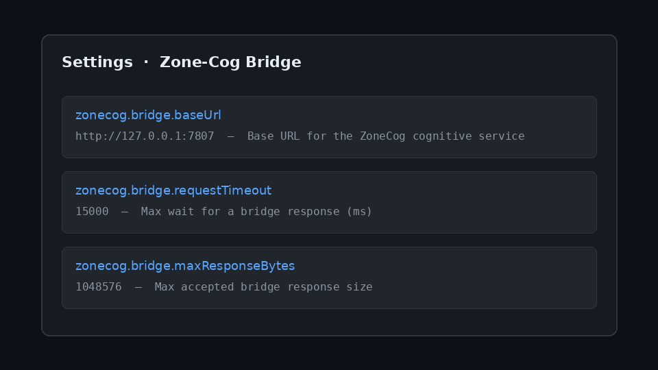

# Zone-Cog Cognitive Bridge



Connect stock **VS Code** or **Azure Data Studio** to the standalone
[ZoneCog cognitive service](../../azure_integration/README.md). The extension
uses only the public VS Code extension API and Node.js HTTP APIs — there is no
`azdata` dependency — so the same VSIX runs in both hosts.

| | |
| --- | --- |
| **Publisher** | `EchoCog` |
| **Extension ID** | `EchoCog.zonecog-bridge` |
| **Marketplace category** | Machine Learning |
| **Default bridge URL** | `http://127.0.0.1:7807` |

> Marketplace install (after publish):  
> `ext install EchoCog.zonecog-bridge`

## Features

- Health-check the local or remote ZoneCog cognitive bridge
- Ingest database schema and table payloads into AtomSpace-style atoms
- Run cognitive analysis / reasoning over schema or atom batches
- Store optional bearer tokens in VS Code **SecretStorage** (never in settings)
- Bound every bridge request by timeout and maximum response size
- Works in local, Remote SSH, Dev Container, and Codespaces workspaces

## Screenshots

### Command Palette



All bridge actions live under the **Zone-Cog** category so they are easy to
discover from the Command Palette (`Ctrl+Shift+P` / `Cmd+Shift+P`).

### Output channel



Results are written as pretty-printed JSON to the **Zone-Cog** output channel.

### Settings



Configure the bridge base URL, request timeout, and max response size from
Settings. Auth tokens are managed separately through a secure command.

## Prerequisites

Start the cognitive service before running bridge commands:

```bash
# from the repository root
pip install .
zonecog-bridge serve
# or:
python -m azure_integration.cli serve
```

Docker alternative:

```bash
docker build -f azure_integration/Dockerfile -t zonecog-bridge .
docker run -p 7807:7807 zonecog-bridge
```

The default endpoint is `http://127.0.0.1:7807`. In a Remote SSH, Dev Container,
or Codespaces workspace the extension runs on the **remote** extension host, so
a loopback endpoint refers to that remote host.

## Install

### From the Marketplace (recommended)

1. Open the Extensions view in VS Code or Azure Data Studio
2. Search for **Zone-Cog Cognitive Bridge**
3. Click **Install**

Or from the command line:

```bash
code --install-extension EchoCog.zonecog-bridge
# Azure Data Studio:
azuredatastudio --install-extension EchoCog.zonecog-bridge
```

### From a VSIX

```bash
cd extensions/zonecog-bridge
yarn install
yarn package
code --install-extension zonecog-bridge-*.vsix
```

## Commands

| Command ID | Title | Description |
| --- | --- | --- |
| `zonecog.checkBridgeHealth` | **Zone-Cog: Check Cognitive Bridge Health** | `GET /health` against the configured bridge and show the JSON status |
| `zonecog.ingestSchema` | **Zone-Cog: Ingest Database Schema** | Validate and `POST /ingest/schema` a tables + foreign_keys payload |
| `zonecog.ingestActiveTable` | **Zone-Cog: Ingest Table Data** | Validate and `POST /ingest/table` a table + rows payload |
| `zonecog.runCognitiveAnalysis` | **Zone-Cog: Run Cognitive Analysis** | Validate and `POST /reason` an atom batch or reason request |
| `zonecog.setBridgeAuthToken` | **Zone-Cog: Set Cognitive Bridge Auth Token** | Store or clear a bearer token in SecretStorage |

The ingestion and analysis commands first use selected editor text, then the
contents of an active JSON document, and otherwise prompt for JSON. Progress is
shown as a notification; results always go to the **Zone-Cog** output channel.

## Configuration

| Setting | Default | Description |
| --- | --- | --- |
| `zonecog.bridge.baseUrl` | `http://127.0.0.1:7807` | Base URL for the ZoneCog cognitive service |
| `zonecog.bridge.requestTimeout` | `15000` | Maximum time in milliseconds to wait for a bridge response |
| `zonecog.bridge.maxResponseBytes` | `1048576` | Maximum accepted bridge response size in bytes |

Auth tokens are stored with VS Code SecretStorage through
**Zone-Cog: Set Cognitive Bridge Auth Token**, not in user or workspace
settings. Use HTTPS when connecting outside a trusted loopback network.

Example `settings.json`:

```json
{
  "zonecog.bridge.baseUrl": "http://127.0.0.1:7807",
  "zonecog.bridge.requestTimeout": 15000,
  "zonecog.bridge.maxResponseBytes": 1048576
}
```

## Payloads

### Schema ingestion

```json
{
  "tables": [
    {
      "schema": "dbo",
      "table": "users",
      "columns": [{ "name": "id" }, { "name": "dept_id" }]
    }
  ],
  "foreign_keys": []
}
```

### Table ingestion

```json
{
  "schema": "dbo",
  "table": "users",
  "primary_key": "id",
  "rows": [{ "id": 1, "dept_id": 10 }]
}
```

### Cognitive analysis

Accepts either an AtomSpace batch or a complete reason request:

```json
{
  "atoms": { "nodes": [], "links": [] },
  "mode": "schema",
  "context": { "source": "editor" }
}
```

## Architecture

```text
┌──────────────────────────┐       HTTP        ┌────────────────────────────┐
│  VS Code / ADS host      │ ───────────────►  │  ZoneCog Python service    │
│  extensions/zonecog-     │  /health          │  azure_integration/        │
│  bridge (this VSIX)      │  /ingest/schema   │  FastAPI + AtomSpace       │
│                          │  /ingest/table    │  adapter (+ optional       │
│  SecretStorage token     │  /reason          │  SQLite persistence)       │
└──────────────────────────┘                   └────────────────────────────┘
```

## Security

- Optional bearer auth is stored only in **SecretStorage**
- Legacy `zonecog.bridge.authToken` settings values are migrated once into
  SecretStorage and then cleared from settings
- Request bodies are validated before send; responses are size-bounded
- Prefer loopback or HTTPS endpoints; do not point the bridge at untrusted hosts

## Development

```bash
cd extensions/zonecog-bridge
yarn install
yarn compile
yarn test
```

`yarn test` compiles the extension and runs transport + payload tests against a
real local HTTP server (no mocks).

## Packaging and pre-publish validation

```bash
yarn package          # builds a .vsix in this directory
yarn package:dry-run  # validates packaging without keeping the artifact
yarn validate:marketplace  # checks manifest, assets, and command metadata
```

Both package scripts run `@vscode/vsce` via `npx`, so no publisher token is
required just to build and validate the package locally.

## Publishing

Automated publish is handled by
[`.github/workflows/zonecog-bridge.yml`](../../.github/workflows/zonecog-bridge.yml):

1. Every PR/push that touches this extension runs compile, tests, and
   `vsce package` dry-run validation
2. Pushing a tag `zonecog-bridge-vX.Y.Z` packages a VSIX, uploads it as a
   workflow artifact, creates a GitHub Release, and (when secrets are
   configured) publishes to the VS Code Marketplace and Open VSX

Publisher account setup, required secrets, and the release checklist are
documented in [`docs/ZONECOG_BRIDGE_PUBLISHING.md`](../../docs/ZONECOG_BRIDGE_PUBLISHING.md).

## License

MIT — see [LICENSE](./LICENSE).
